# Задание 1. Повышение безопасности системы
1. Диаграмма архитектуры системы в [draw.io](./task-1.drawio)
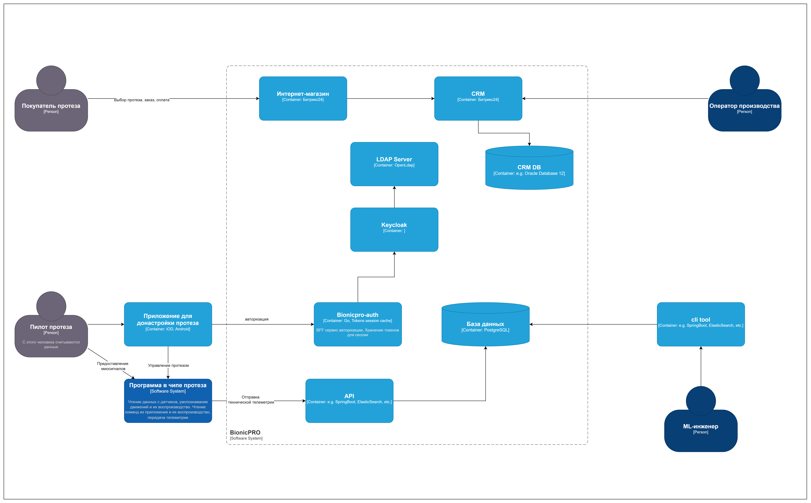
2. Код в репозитории, реализующий PKCE flow. [bionicpro-auth](./bionicpro-auth/main.go)
3. Код нового бэкенд-сервиса, который реализует получение access- и refresh-токенов и генерации пользовательской сессии. [bionicpro-auth](./bionicpro-auth/main.go)
4. Изменён код фронтенда для работы с сессиями вместо интеграции с Keycloak напрямую [frontend](./frontend/src/components/ReportPage.tsx)
5. Экспортирован realm [keycloak-results-export.json](./keycloak/keycloak-results-export.json)
6. Добавлен OAuth 2.0 от Яндекс ID

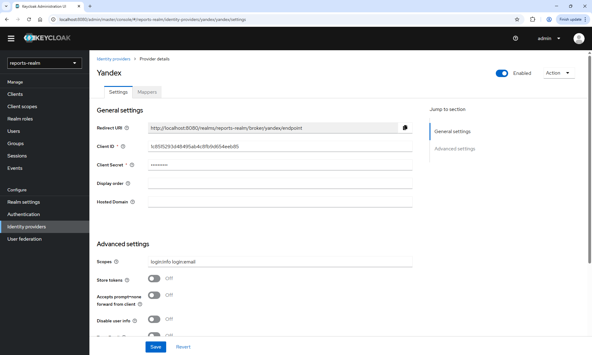
login: alexis.moore@example.com
password: pass
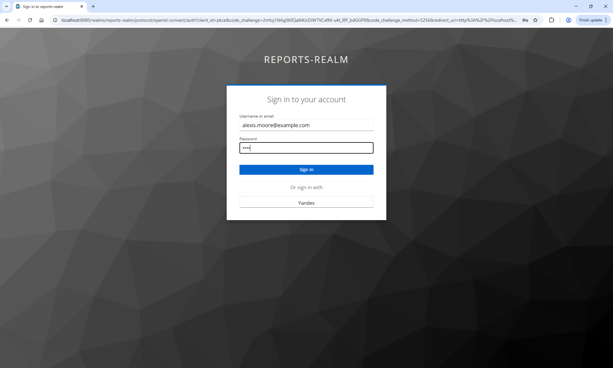
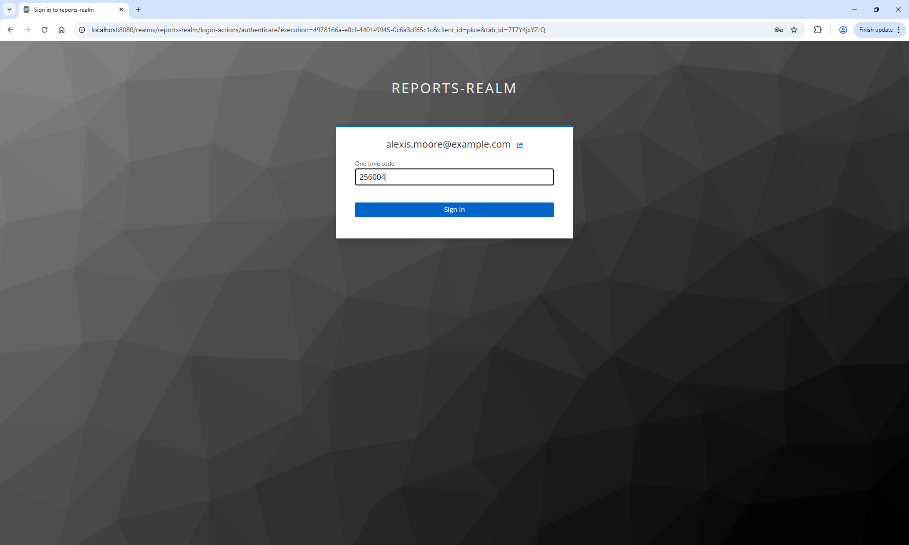
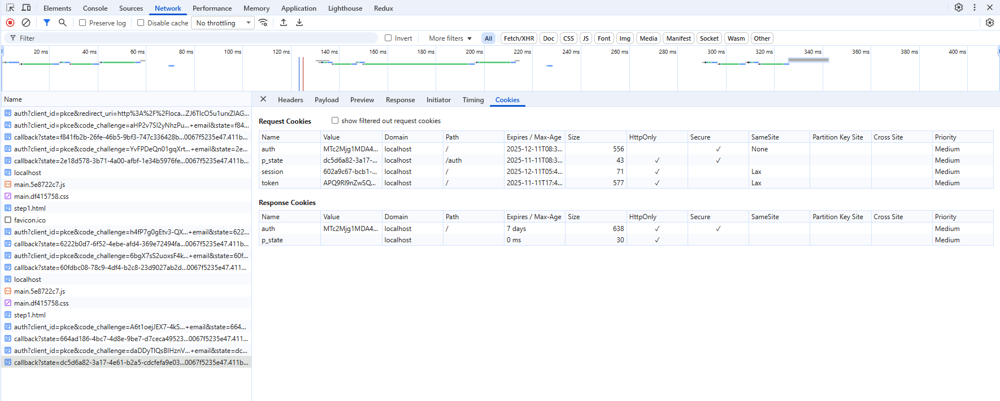

# Задание 2. Разработка сервиса отчётов
1. Диаграмма архитектуры системы в [draw.io](./images/task-2.drawio)
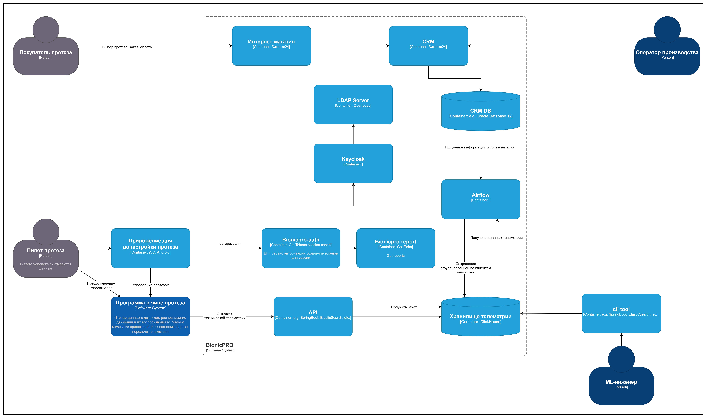
2. Код в репозитории, связанный с Airflow в отдельную папку [Airflow](./airflow/dags/dag_sample.py)
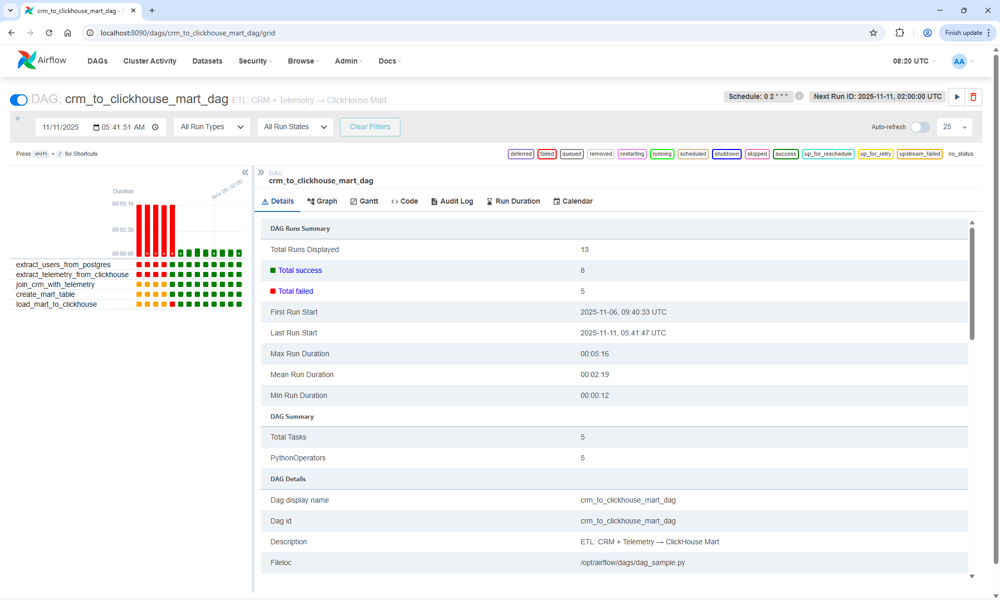
3. Сбор данных из ClickHouse [Report service](./bionicpro-report/main.go)

# Задание 3. Снижение нагрузки на базу данных

1. Добавлен в сервис API код схемы взаимодействия с S3 и CDN, указанной в задании. [Report service](./bionicpro-report/main.go)
2. Добавлен файл конфигурации Nginx с настройками reverse proxy в отдельную папку nginx. [CDN](./nginx/nginx.conf)
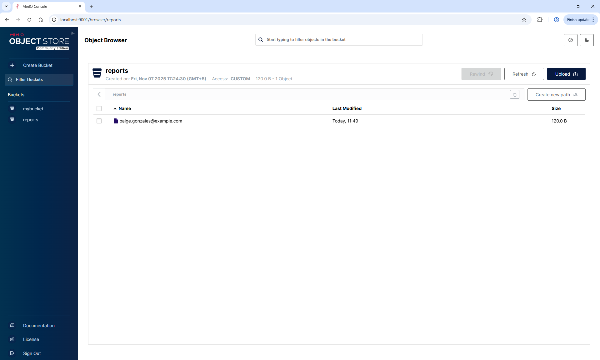
3. 
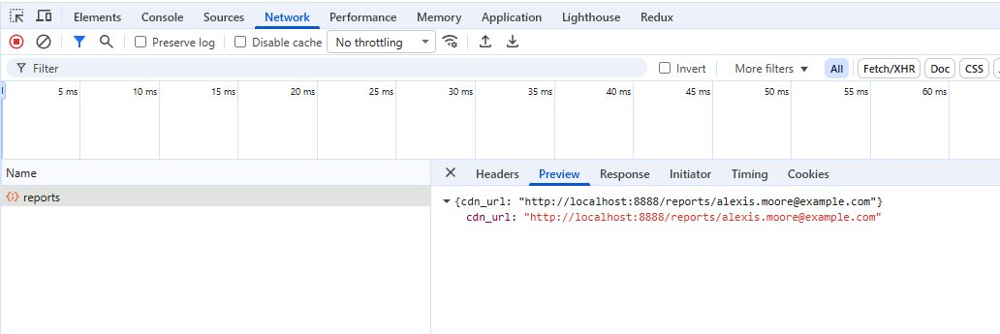
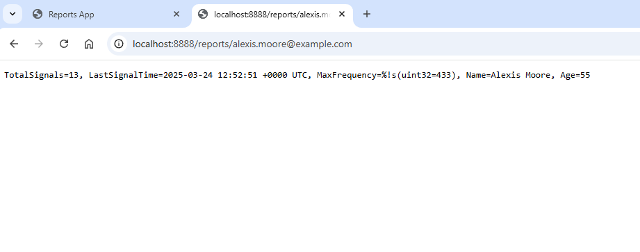

# Задание 4. Повышение оперативности и стабильности работы CRM
- [crm-connector](./debezium/crm-connector.json)
- Add debezum crm-connector
``` bash
sh ./debezium/init.sh
```
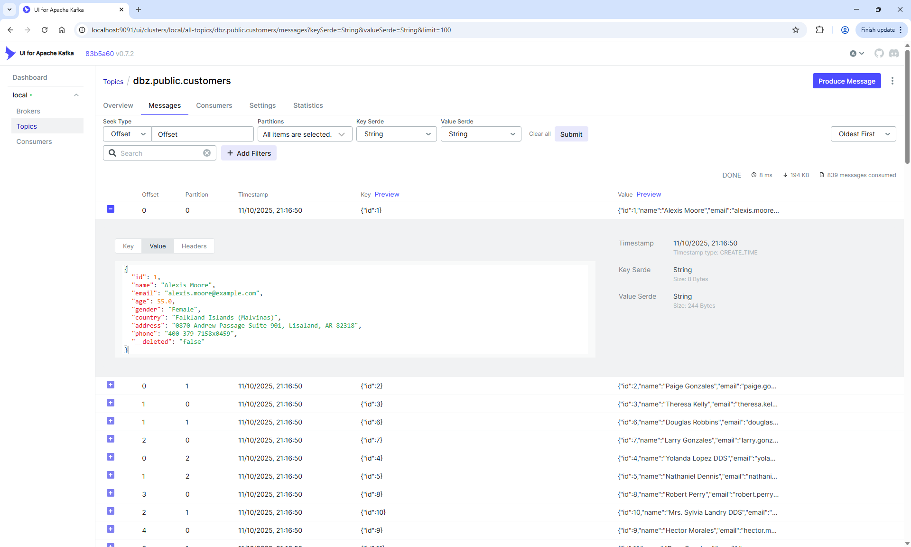
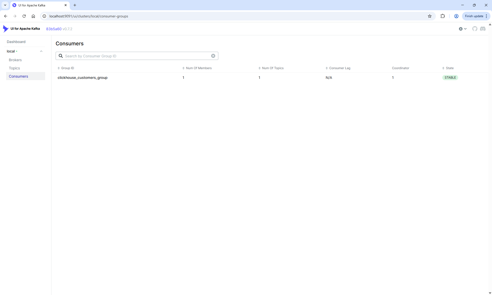

- Add new signals to olap-db to populate Materialized View

Example:
```sql
INSERT INTO emg_sensor_data
SELECT *
FROM file('olap.csv', 'CSV');
```


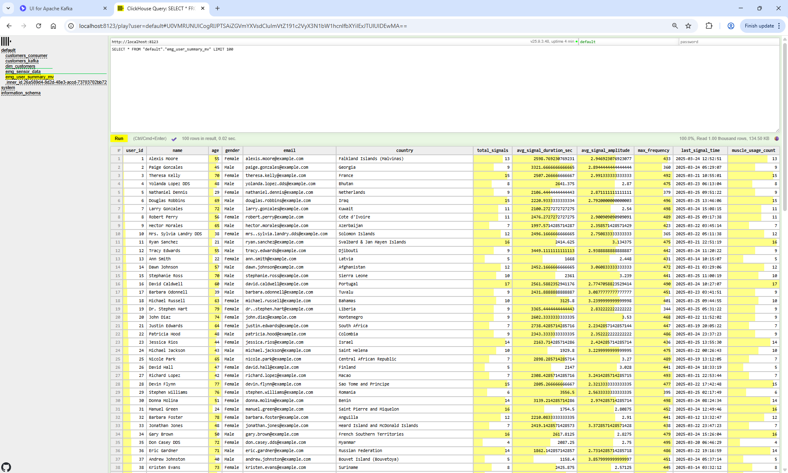